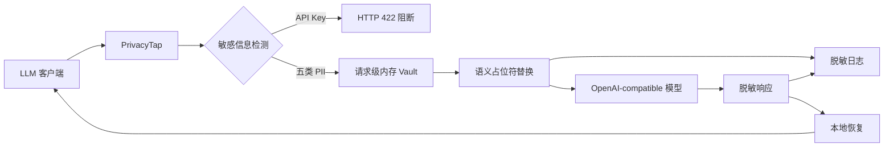

# PrivacyTap

PrivacyTap 是一个独立实现的 OpenAI-compatible 大模型隐私代理，用于解决：

> Prompt 中的结构化敏感信息会同时暴露给第三方模型服务和调用日志。

代理在请求离开本机前匿名化手机号、身份证号、邮箱、银行卡号和学号；检测到 API Key 或 Bearer Token 时直接阻断。模型响应中的占位符在本地恢复，模型上游和安全日志始终看不到原始值。

## 工作流程



## 支持的数据

| 类型 | 处理策略 |
|---|---|
| 中国大陆手机号 | `[PHONE_n]` 可逆替换 |
| 中国居民身份证 | 校验位通过后 `[CN_ID_n]` |
| 邮箱 | `[EMAIL_n]` 可逆替换 |
| 银行卡 | Luhn 通过后 `[BANK_CARD_n]` |
| 学号 | 具有“学号/Student ID”上下文时替换 |
| API Key / Bearer Token | HTTP 422 阻断，不请求上游 |

首版仅支持非流式 `POST /v1/chat/completions`。`stream=true` 会返回 HTTP 400。

## 安装

```powershell
git clone https://github.com/aRookiehuang/privacyTap.git
Set-Location privacyTap
python -m venv .venv
.\.venv\Scripts\python.exe -m pip install -e ".[dev]"
```

## 离线演示

演示不需要真实模型 Key。

### Terminal 1：Mock 模型

```powershell
.\.venv\Scripts\python.exe examples\mock_upstream.py
```

### Terminal 2：PrivacyTap

```powershell
.\.venv\Scripts\privacytap.exe start `
  --port 8080 `
  --upstream-base-url http://127.0.0.1:18080 `
  --archive-dir .\privacytap-traces
```

### Terminal 3：演示客户端

```powershell
.\.venv\Scripts\python.exe examples\demo_client.py
```

如 `8080` 已占用：

```powershell
# Terminal 2
.\.venv\Scripts\privacytap.exe start `
  --port 18081 `
  --upstream-base-url http://127.0.0.1:18080

# Terminal 3
$env:PRIVACYTAP_PROXY_URL="http://127.0.0.1:18081/v1/chat/completions"
.\.venv\Scripts\python.exe examples\demo_client.py
```

## 连接真实模型

```powershell
$env:PRIVACYTAP_UPSTREAM_BASE_URL="https://api.example.com"
.\.venv\Scripts\privacytap.exe start
```

客户端 Base URL 配置为：

```text
http://127.0.0.1:8080/v1
```

传输层 `Authorization` Header 会转发给上游，但不会进入日志。凭证若出现在 Prompt 或 JSON 内容中则会被阻断。

## 可选观测输出

默认只保存本地脱敏 JSON/Markdown。可选安装 Langfuse 适配器：

```powershell
.\.venv\Scripts\python.exe -m pip install -e ".[langfuse]"

$env:LANGFUSE_PUBLIC_KEY="pk-lf-..."
$env:LANGFUSE_SECRET_KEY="sk-lf-..."
$env:LANGFUSE_BASE_URL="http://127.0.0.1:3000"

.\.venv\Scripts\privacytap.exe start `
  --upstream-base-url http://127.0.0.1:18080 `
  --exporter langfuse
```

Langfuse 仅是可选输出适配器，不属于 PrivacyTap 核心链路；不可用时自动退回本地脱敏归档。

## 测试

```powershell
.\.venv\Scripts\python.exe -m pytest -q

.\.venv\Scripts\python.exe -m pytest `
  --cov=privacytap `
  --cov-report=term-missing `
  --cov-fail-under=90 -q

.\.venv\Scripts\python.exe scripts\evaluate_privacy.py
```

## 项目边界

PrivacyTap 不处理姓名、自然语言地址、图片或音频中的隐私，不支持流式恢复，也不是法律合规认证产品。它不防御已被攻陷的本机、进程内存转储或绕过代理的直接调用。

## 相关工作

项目设计阶段参考了：

- [TokenTap](https://github.com/jmuncor/tokentap) 的本地代理拦截思路；
- [Langfuse](https://github.com/langfuse/langfuse) 的 LLM 可观测性思路；
- [Microsoft Presidio](https://github.com/microsoft/presidio) 的 PII 检测设计；
- [LLM Guard](https://github.com/protectai/llm-guard) 的输入匿名化设计。

PrivacyTap 不依赖 TokenTap，核心运行也不依赖 Langfuse。

## 文档

- [课程项目档案](docs/project-brief.md)
- [实验设计](docs/experiment.md)
- [威胁模型](docs/threat-model.md)
