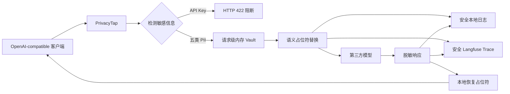

# PrivacyTap

面向大模型调用的全链路可逆匿名化隐私代理。

> **问题：** Prompt 中的手机号、身份证、邮箱、银行卡、学号和 API Key，可能同时泄露给第三方模型、TokenTap 本地日志和 Langfuse Trace。

PrivacyTap 基于 [TokenTap](https://github.com/jmuncor/tokentap) 的 OpenAI-compatible 代理能力，在请求离开本机前匿名化五类 PII，对 API Key 直接阻断；模型响应先以脱敏状态进入日志和 Langfuse，再在本地恢复后返回用户。

## 数据流



## 支持范围

| 类型 | 示例策略 |
|---|---|
| 手机号 | `13812345678` → `[PHONE_1]` |
| 中国居民身份证 | 校验位通过后 → `[CN_ID_1]` |
| 邮箱 | `alice@example.com` → `[EMAIL_1]` |
| 银行卡 | Luhn 通过后 → `[BANK_CARD_1]` |
| 学号 | 带“学号/Student ID”上下文 → `[STUDENT_ID_1]` |
| API Key / Bearer Token | 直接返回 HTTP 422，不请求上游 |

MVP 仅支持非流式 `POST /v1/chat/completions`。流式请求会明确返回 HTTP 400。

## 安装

```powershell
git clone <本仓库地址> privacytap
Set-Location privacytap
python -m venv .venv
.\.venv\Scripts\python.exe -m pip install -e ".[dev]"
```

如需 Langfuse：

```powershell
.\.venv\Scripts\python.exe -m pip install -e ".[dev,langfuse]"
```

## 无模型 Key 离线演示

打开三个 PowerShell 终端。

### Terminal 1：启动 Mock 模型

```powershell
.\.venv\Scripts\python.exe examples\mock_upstream.py
```

### Terminal 2：启动 PrivacyTap

```powershell
.\.venv\Scripts\tokentap.exe privacy-start `
  --port 8080 `
  --upstream-base-url http://127.0.0.1:18080 `
  --archive-dir .\privacytap-traces
```

### Terminal 3：发送三组请求

```powershell
.\.venv\Scripts\python.exe examples\demo_client.py
```

若 `8080` 已被占用，可同时修改代理端口和客户端环境变量：

```powershell
# Terminal 2
.\.venv\Scripts\tokentap.exe privacy-start `
  --port 18081 `
  --upstream-base-url http://127.0.0.1:18080

# Terminal 3
$env:PRIVACYTAP_PROXY_URL="http://127.0.0.1:18081/v1/chat/completions"
.\.venv\Scripts\python.exe examples\demo_client.py
```

演示包括：

1. 五类 PII 匿名化后发送，响应恢复；
2. 无敏感数据的普通请求；
3. API Key 被 422 阻断。

## 三端看到的数据

| 位置 | 看到的内容 |
|---|---|
| 第三方模型 | `[PHONE_1]`、`[EMAIL_1]` 等占位符 |
| TokenTap / Langfuse | 脱敏请求与脱敏上游响应 |
| 最终用户 | 通过请求级 Vault 恢复后的响应 |

Vault 仅存在于单次请求内存中，不写磁盘、不上传，也不跨请求共享。

## 连接真实 OpenAI-compatible 服务

```powershell
$env:PRIVACYTAP_UPSTREAM_BASE_URL="https://api.example.com"
.\.venv\Scripts\tokentap.exe privacy-start
```

客户端将 Base URL 指向：

```text
http://127.0.0.1:8080/v1
```

合法的传输层 `Authorization` Header 会被转发给上游，但不会进入安全事件或日志。若凭证出现在 Prompt/JSON 内容中，则请求被阻断。

## Langfuse

```powershell
$env:LANGFUSE_PUBLIC_KEY="pk-lf-..."
$env:LANGFUSE_SECRET_KEY="sk-lf-..."
$env:LANGFUSE_BASE_URL="http://127.0.0.1:3000"

.\.venv\Scripts\tokentap.exe privacy-start `
  --upstream-base-url http://127.0.0.1:18080 `
  --langfuse
```

Langfuse 不可用时，本地模型请求仍可完成；导出失败不会破坏主链路。

## 测试与评测

```powershell
.\.venv\Scripts\python.exe -m pytest -q

.\.venv\Scripts\python.exe -m pytest `
  --cov=tokentap.privacy `
  --cov=tokentap.privacy_proxy `
  --cov=tokentap.safe_archive `
  --cov-report=term-missing `
  --cov-fail-under=90

.\.venv\Scripts\python.exe scripts\evaluate_privacy.py
```

评测脚本输出 Precision、Recall、F1、P50 和 P95 检测耗时。实验数据位于 `tests/fixtures/privacy_cases.json`。

## 项目边界

PrivacyTap 解决的是结构化敏感信息离开本机和进入观测系统的问题。它不是法律合规认证产品，也不防御已被攻陷的本机、内存转储、绕过代理的直接调用或图片/音频中的隐私。

## 文档

- [课程项目档案](docs/project-brief.md)
- [实验与指标](docs/experiment.md)
- [威胁模型](docs/threat-model.md)

## 开源基础

- [TokenTap](https://github.com/jmuncor/tokentap)：代理、Token 统计和 CLI 基础，MIT License。
- [Langfuse](https://github.com/langfuse/langfuse)：可选 LLM Trace 展示。
- [Microsoft Presidio](https://github.com/microsoft/presidio)：通用 PII 检测参考。
- [LLM Guard](https://github.com/protectai/llm-guard)：LLM 输入匿名化参考。

本项目保留上游 TokenTap 的 MIT License。
