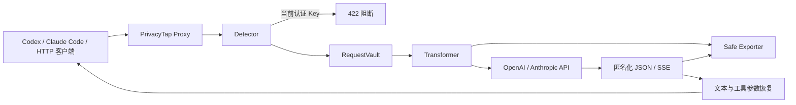

# PrivacyTap 课程项目档案

## 1. 问题背景

LLM 应用通常把用户输入发送给第三方模型，并记录请求、响应、Token 和延迟。用户一旦在 Prompt 中输入手机号、身份证号、邮箱、银行卡号、学号或 API Key，同一敏感值可能同时存在于模型服务商、应用日志、观测系统和备份中。

核心问题是：

> 如何在不让模型上游和观测日志获得原始敏感信息的前提下，尽量保持请求和响应的业务可用性？

## 2. 现有方式的不足

- 只做日志脱敏，无法阻止原文发送给模型；
- 直接删除敏感信息，会破坏模型对实体的引用；
- 把 API Key 当作普通 PII 替换，仍可能继续发送高风险凭证；
- 使用全局映射，会导致并发请求之间发生数据串线。

## 3. 解决方案

PrivacyTap 是独立实现的本地 AI 隐私代理：

1. 检测请求 JSON 中的六类敏感信息；
2. 业务 PII 与代码示例凭证替换为具有语义的稳定占位符；
3. 映射仅保存在本次请求的内存 Vault；
4. 当前请求实际使用的认证 Key 出现在 Prompt 时返回 HTTP 422；
5. 上游仅接收匿名化请求；
6. 日志仅保存匿名化请求和匿名化上游响应；
7. JSON、SSE 文本和工具调用参数在本地恢复后返回客户端。

## 4. 架构

## 5. 数据策略

| 数据 | 检测方法 | 策略 |
|---|---|---|
| 手机号 | 中国大陆号段正则 | 可逆匿名化 |
| 身份证 | 18 位结构 + 校验位 | 可逆匿名化 |
| 邮箱 | 邮箱结构正则 | 可逆匿名化 |
| 银行卡 | 16–19 位候选 + Luhn | 可逆匿名化 |
| 学号 | 关键词上下文 + 格式 | 可逆匿名化 |
| 代码凭证示例 | 常见前缀与 Bearer 模式 | 可逆匿名化 |
| 当前认证 Key | 与传输 Header 中 Key 精确比较 | 直接阻断 |

## 6. 项目价值

1. 同时保护模型调用链路与观测链路；
2. 使用可逆占位符平衡隐私和响应可用性；
3. 对 PII 与认证凭证采用不同治理策略；
4. 请求级 Vault 避免并发串线；
5. 使用人工数据集和 Mock 上游形成可重复实验。

## 7. 实现范围

当前支持：

- OpenAI `POST /v1/responses` 的 JSON、SSE 和工具参数恢复；
- Anthropic `POST /v1/messages` 的 JSON、SSE 和工具参数恢复；
- Claude Code 使用的 `POST /v1/messages/count_tokens`；
- 非流式 `POST /v1/chat/completions` 兼容演示；
- 本地安全归档和可选 Langfuse 输出。

当前不实现 WebSocket Responses、姓名/地址 NER、图片与音频识别、权限系统、
计费系统或自建观测 UI。

## 8. 实验

- 检测 Precision、Recall、F1；
- 上游原始信息泄露率；
- 本地归档原始信息泄露率；
- 响应恢复正确率；
- API Key 阻断率；
- 50 并发请求隔离；
- 匿名化 P95 处理耗时。

完整实验步骤、证据充分性标准和结果表见
[课程完整实验计划](course-experiment-plan.md)。

## 9. 参考思路

设计阶段参考本地代理拦截、LLM 可观测性、通用 PII 检测和 LLM 输入匿名化等开源实践。PrivacyTap 的运行链路、CLI、隐私核心和测试均为独立实现。

## 10. 限制

规则检测无法覆盖所有自然语言实体；需要读取敏感值本身的任务可能受匿名化影响；系统不防御已被攻陷的本机，也不构成法律合规认证。
