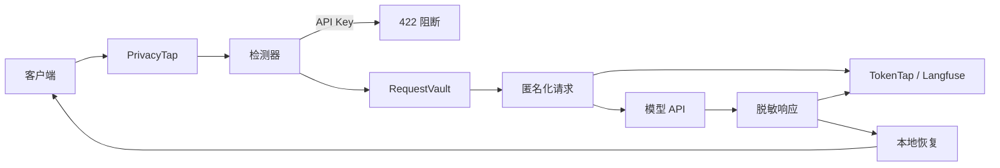

# PrivacyTap 课程项目计划书

## 1. 背景

大模型应用会把用户输入发送给第三方模型，并通过日志或 LLM 可观测平台记录请求、响应、Token 和延迟。记录完整 Prompt 有利于调试，但也扩大了隐私数据的复制范围。

## 2. 发现的问题

用户可能在 Prompt 中输入手机号、身份证号、邮箱、银行卡号、学号或 API Key。未经处理的数据可能同时出现在：

1. 第三方模型服务商收到的请求；
2. TokenTap 保存的 Markdown/JSON；
3. Langfuse Trace；
4. 日志备份、导出与截图。

这属于“模型调用泄露 + 可观测链路二次泄露”的组合问题。

## 3. 现有方案不足

- 只在 Langfuse 前 masking：模型服务商仍能看到原文。
- 只删除敏感信息：模型回复无法保持指代关系。
- 把 API Key 当普通 PII：凭证仍被发送，风险不可接受。
- 使用全局映射：并发请求可能串线，扩大泄露。

## 4. 项目目标

实现一个小型、可运行、可量化的 OpenAI-compatible 隐私代理：

- 五类 PII 在本地替换为稳定语义占位符；
- API Key 在本地直接阻断；
- 第三方模型和观测系统只看到脱敏副本；
- 最终响应在本地恢复；
- 映射按请求隔离且不持久化。

## 5. 系统架构

## 6. 六类数据策略

| 数据 | 检测 | 策略 |
|---|---|---|
| 手机号 | 中国大陆号段正则 | 可逆匿名化 |
| 身份证 | 18 位正则 + 校验位 | 可逆匿名化 |
| 邮箱 | 邮箱结构正则 | 可逆匿名化 |
| 银行卡 | 16–19 位候选 + Luhn | 可逆匿名化 |
| 学号 | 关键词上下文 + 格式 | 可逆匿名化 |
| API Key | 前缀与 Bearer 模式 | 直接阻断 |

## 7. 关键设计价值

1. **全链路保护：** 同时保护模型调用与可观测链路。
2. **可逆占位符：** 隐私值不离开本机，同时保留模型对实体的引用能力。
3. **分类治理：** 普通 PII 可逆匿名化，认证凭证直接阻断。
4. **请求级隔离：** 每个请求独立 Vault，避免并发串线。

## 8. 实现范围

首版支持非流式 `POST /v1/chat/completions`，不支持 Anthropic、Gemini、Responses API、SSE、图片识别、姓名/地址 NER、Redis 或管理后台。

## 9. 实验设计

使用人工标注数据集验证检测 Precision、Recall 和 F1；使用本地 Mock 上游验证上游泄露率；扫描安全事件、Markdown、JSON 与 Langfuse mock 参数验证观测泄露率；并发 50 个请求验证 Vault 隔离；统计检测 P95 耗时。

## 10. 预期价值

该 Demo 可作为 AI 应用接入第三方模型之前的隐私边界，展示如何用中间代理减少结构化敏感数据的外发和长期留存。项目不依赖训练模型，结果可复现、可测试、可量化。

## 11. 限制与未来工作

- 规则无法覆盖姓名、地址等开放实体；
- 匿名化会影响“校验身份证内容”一类必须读取原值的任务；
- 首版不支持流式响应；
- 后续可加入中文 NER、策略白名单、SSE 增量恢复和审计面板。

## 12. 开源与许可证

项目基于 TokenTap MIT License 开发；Langfuse 为可选观测依赖。Presidio 和 LLM Guard 仅作为检测与匿名化设计参考，首版未引入重量级 NER 依赖。
