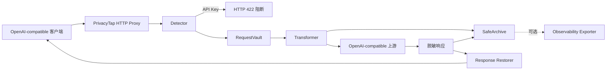

# Standalone PrivacyTap 重构设计

## 1. 目标

将当前基于 TokenTap 仓库改造的实现，重构为一个完全独立的课程 Demo：

> PrivacyTap：面向 OpenAI-compatible 大模型调用的全链路可逆匿名化隐私代理。

Langfuse 与 TokenTap 只作为设计参考：

- 借鉴 TokenTap 的本地代理拦截思路；
- 借鉴 Langfuse 的 LLM 调用可观测思路；
- 不继承 TokenTap 的代码、命令和产品结构；
- 不要求部署或安装 Langfuse；
- 项目即使删除所有参考项目集成，也能独立运行和完成实验。

## 2. 要解决的问题

用户可能在 Prompt 中输入手机号、身份证号、邮箱、银行卡号、学号和 API Key。未经处理的数据会：

1. 被发送到第三方模型服务商；
2. 被代理、日志或可观测平台长期保存；
3. 在备份、导出和截图中继续传播。

只做日志脱敏不能阻止数据发送给模型；简单删除敏感信息又会破坏模型回复中的实体引用。

PrivacyTap 在本机完成：

- 五类 PII 检测与语义占位符替换；
- 请求级内存映射；
- API Key 直接阻断；
- 脱敏请求转发；
- 脱敏日志记录；
- 模型响应占位符恢复。

## 3. 独立性原则

重构完成后必须满足：

1. Python 包名为 `privacytap`，不再存在 `tokentap` 包；
2. 命令为 `privacytap start`，不再存在 `tokentap` 命令；
3. 项目元数据、README、测试和构建产物均使用 PrivacyTap 名称；
4. 不包含 TokenTap 的 Dashboard、Claude、Gemini、Codex 启动命令；
5. 不包含 TokenTap 的 Provider 路由、Prompt 归档格式和 Token 仪表盘；
6. 运行依赖不包含 TokenTap；
7. Langfuse 仅作为可选输出适配器，不属于核心链路；
8. 默认模式仅写本地脱敏 JSON/Markdown；
9. 删除 Langfuse 适配器后，核心测试、CLI、Demo 和评测仍全部通过；
10. 文档只在“相关工作/参考思路”中提及 Langfuse 和 TokenTap。

## 4. 方案选择

### 方案 A：继续维护 TokenTap Fork

优点是改动少；缺点是项目定位不独立，包含大量无关功能，答辩时容易被认为只是增加一个插件。

### 方案 B：逐步改名并删除无关模块

可以保留当前经过验证的隐私核心，但需要仔细迁移包路径、测试、CLI 和构建元数据。

### 方案 C：建立全新空仓库并重新实现

边界最干净，但会重复已验证的检测、Vault 和代理代码，增加回归风险。

### 采用方案

采用 **方案 B**：保留由本项目自行实现并已测试的隐私核心，将其迁入独立 `privacytap` 包；删除所有 TokenTap 原有功能和命名。

## 5. 最终架构



### 5.1 Detector

检测六类结构化信息：

- 中国大陆手机号；
- 中国居民身份证号及校验位；
- 邮箱；
- 银行卡号及 Luhn 校验；
- 带上下文的学号；
- API Key/Bearer Token。

### 5.2 RequestVault

- 每次请求创建一个实例；
- 相同敏感值获得稳定占位符；
- 不跨请求共享；
- 不序列化、不写磁盘；
- 请求结束后由 Python 回收。

### 5.3 Transformer

- 递归处理 OpenAI-compatible JSON；
- 五类 PII 替换为语义占位符；
- API Key 抛出阻断异常；
- 不修改调用方传入的原对象；
- 递归恢复 JSON 响应中的占位符。

### 5.4 Proxy

- 仅支持 `POST /v1/chat/completions`；
- 首版仅支持非流式响应；
- 保留合法的传输层 `Authorization` Header；
- Header 不进入日志；
- 上游只能收到脱敏请求；
- 客户端收到恢复后的响应。

### 5.5 SafeArchive

- 只接受已经脱敏的事件；
- 保存脱敏请求、脱敏上游响应、模型、Token、检测类型和耗时；
- 不接收 RequestVault、原始请求和恢复后的响应。

### 5.6 Observability Exporter

定义独立协议：

```python
class SafeEventExporter(Protocol):
    def export(self, event: SafeEvent) -> None: ...
```

默认实现：

- `FileExporter`：本地 JSON/Markdown。

可选示例：

- `LangfuseExporter`：通过额外依赖安装；
- exporter 失败不能影响模型调用；
- 核心代码不得导入 Langfuse。

## 6. 最终目录

```text
privacyTap/
├─ privacytap/
│  ├─ __init__.py
│  ├─ cli.py
│  ├─ proxy.py
│  ├─ archive.py
│  ├─ exporters.py
│  └─ privacy/
│     ├─ __init__.py
│     ├─ models.py
│     ├─ validators.py
│     ├─ detectors.py
│     ├─ vault.py
│     └─ transformer.py
├─ integrations/
│  └─ langfuse_exporter.py
├─ examples/
│  ├─ mock_upstream.py
│  ├─ demo_client.py
│  └─ demo_prompts.json
├─ scripts/
│  └─ evaluate_privacy.py
├─ tests/
├─ docs/
│  ├─ project-brief.md
│  ├─ experiment.md
│  └─ threat-model.md
├─ pyproject.toml
├─ README.md
└─ LICENSE
```

## 7. CLI

核心命令：

```powershell
privacytap start `
  --port 8080 `
  --upstream-base-url http://127.0.0.1:18080 `
  --archive-dir .\privacytap-traces
```

可选 Langfuse：

```powershell
privacytap start `
  --upstream-base-url http://127.0.0.1:18080 `
  --exporter langfuse
```

CLI 不负责启动 Claude、Gemini、Codex 或其他第三方工具。

## 8. 数据安全不变量

以下条件必须由测试证明：

1. 原始 PII 不出现在上游请求；
2. 原始 PII 不出现在安全事件；
3. 原始 PII 不出现在本地归档；
4. 原始 PII 不出现在可选 exporter 参数；
5. API Key 请求不会到达上游；
6. 422 响应不回显 API Key；
7. 不同并发请求的 Vault 不串线；
8. 合法 Authorization Header 可以转发但不能记录；
9. exporter 异常不影响客户端响应；
10. 流式请求明确拒绝，不静默降级。

## 9. 测试策略

### 单元测试

- 身份证校验；
- Luhn 校验；
- 六类检测；
- 误报样例；
- 占位符稳定性；
- 请求级隔离；
- JSON 匿名化与恢复。

### 集成测试

- aiohttp 本地 Mock 上游；
- 脱敏请求到达上游；
- 最终响应恢复；
- API Key 阻断；
- Header 转发与日志隔离；
- 50 个并发请求隔离；
- FileExporter 与可选 exporter 只接收安全事件。

### 回归门禁

- 所有测试通过；
- 核心覆盖率不低于 90%；
- 人工数据集 Precision、Recall、F1 不低于 0.95；
- 完整检测和替换 P95 低于 20 ms；
- 离线 Demo 不需要真实模型 Key；
- 构建出的包只能暴露 `privacytap` 命令和包。

## 10. 迁移策略

1. 为独立包路径编写失败测试；
2. 将隐私模块从 `tokentap/privacy` 迁至 `privacytap/privacy`；
3. 将 `privacy_proxy.py` 迁为 `privacytap/proxy.py`；
4. 将安全归档迁为 `privacytap/archive.py`；
5. 建立独立 exporter 接口；
6. 将 Langfuse 适配器移至 `integrations/`；
7. 重写 CLI；
8. 迁移测试导入；
9. 删除 TokenTap 原始模块和测试；
10. 更新包元数据、README、课程文档和许可证说明；
11. 构建 wheel 并检查其中不存在 `tokentap/`；
12. 推送到 `aRookiehuang/privacyTap` 的 `main`。

不使用保留旧包名的兼容层，因为课程项目不需要向后兼容，兼容层会继续造成产品归属混淆。

## 11. 项目表述

答辩中使用：

> 本项目借鉴本地代理与 LLM 可观测系统的设计思路，独立实现了 PrivacyTap。它在模型请求离开本机前完成结构化敏感信息检测、可逆匿名化和凭证阻断，并保证模型上游及观测日志均不持有原始隐私值。

不使用：

- “TokenTap 插件”；
- “Langfuse 增强模块”；
- “基于 Langfuse 实现”；
- “在 TokenTap 上增加功能”。

## 12. 非目标

- 不构建完整 LLMOps 平台；
- 不复制 Langfuse 的 Trace UI；
- 不复制 TokenTap 的 Token Dashboard；
- 不支持所有模型厂商协议；
- 不训练 NER 模型；
- 不宣称满足特定法律合规认证；
- 不做用户、组织、权限和计费系统。
